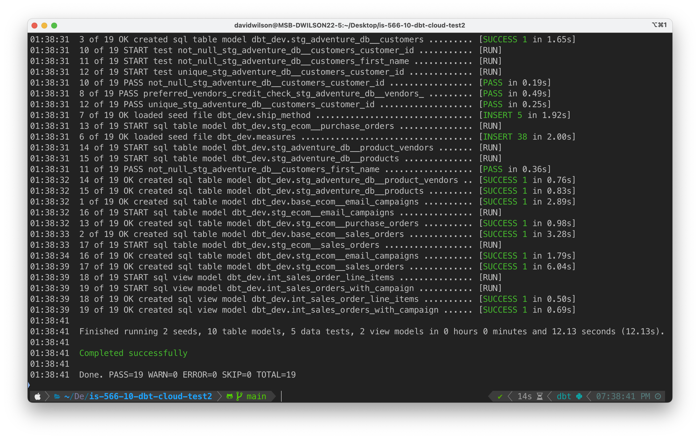
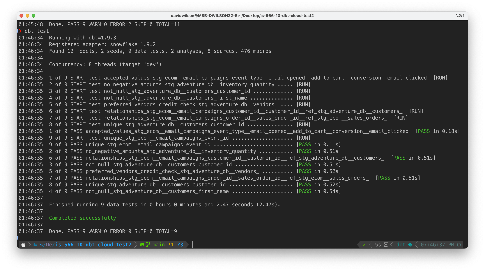
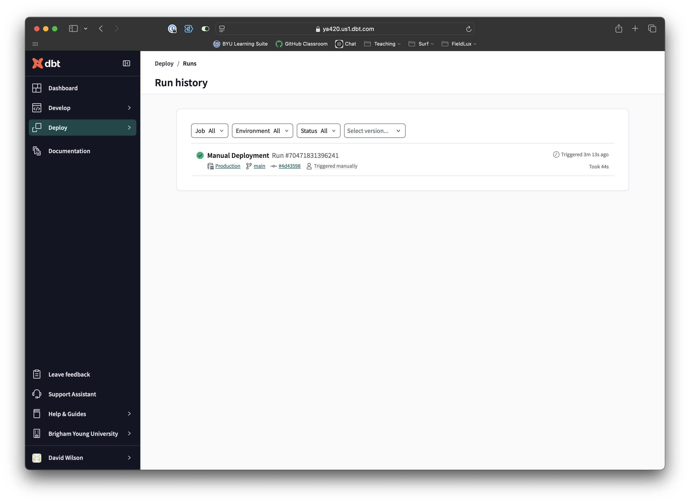

# Hands-On Lab: DataOps with dbt Cloud

The dbt adventure continues! This lab will build on the foundation we started in the previous assignment, focusing on some of the more advanced capabilities of dbt. In particular, we'll be exploring how dbt's functionality can support true _DataOps_, which allows a data team to provide and maintain reliable, trustworthy data assets. This is, in many ways, the pinnacle of the modern data platform, and it's something that we've been building toward throughout the semester.

---

## Overview of the Lab

Just as with the previous lab, I'm going to outline the goals and major steps you'll be accomplishing in the assignment. 

**Overall Goal**: With the data flows already in place from last week's assignment, we'll be learning about how dbt's testing framework and github integration enable data teams to ensure data integrity, collaborate on a shared code base, and provide continuous integration as the warehouse schema is iteratively improved. 

Here are the general steps you'll be following:
1. First, we'll write a couple "analysis" models that will represent the _gold layer_ of our warehouse, providing a couple of analysis-oriented table structures that will serve as the motivation for ensuring that we can trust the output of our warehouse. 
2. Next, we'll learn about dbt's testing framework(s) and get some practice writing some tests that we can use to ensure that our tables contain the data we think they do, and to alerts us of breaking changes to either the data or the warehouse logic as we're iteratively developing the warehouse models. 
3. With tests in place, it's time to learn to use dbt Cloud to provide true "DataOps" for the data assets we're working on. We'll get your repository tied in with dbt Cloud, set up dev and prod environments, and otherwise make ourselves feel like _legit_ data platform developers.
4. After setting things up in step 3, we'll finish by developing some new functionality to incorporate some updates to our email campaign data. Then we'll go through a release process in which we ensure that everything is A-OK before merging those changes into the production warehouse. 

Like last time, I'm going to share the "ending state" folder hierarchy so that you know what you're aiming for at the end of your journey:

```bash
is-566-10-dbt-cloud
├── analyses                                             
│  ├─ campaign_sales_analysis.sql        # <-- Part 1    
│  └─ email_campaign_performance.sql     # <-- Part 1    
├─ dbt_project.yml                                       
├─ macros                                                
├─ models                                                
│  ├─ models.yml        # <-- Part 2                     
│  ├─ intermediate                                       
│  │  ├─ int_sales_order_line_items.sql                  
│  │  └─ int_sales_orders_with_campaign.sql              
│  └─ staging                                            
│     ├─ adventure_db                                    
│     │  ├─ stg_adventure_db__customers.sql              
│     │  ├─ stg_adventure_db__inventory.sql              
│     │  ├─ stg_adventure_db__product_vendors.sql        
│     │  ├─ stg_adventure_db__products.sql               
│     │  └─ stg_adventure_db__vendors.sql                
│     ├─ ecom                                            
│     │  ├─ base                                         
│     │  │  ├─ base_ecom__email_campaigns.sql            
│     │  │  ├─ base_ecom__email_mktg_new.sql # <-- Part 4
│     │  │  └─ base_ecom__sales_orders.sql               
│     │  ├─ stg_ecom__email_campaigns.sql    # <-- Part 4
│     │  ├─ stg_ecom__purchase_orders.sql                
│     │  └─ stg_ecom__sales_orders.sql                   
│     └─ sources.yml                         # <-- Part 4
├─ screenshots                                           
├─ seeds                                                 
│  ├─ _seeds.yml                                         
│  ├─ measures.csv                                       
│  └─ ship_method.csv                                    
└─ tests                                                 
   └─ generic                                            
      ├─ column_fully_null.sql             # <-- Part 2  
      ├─ positive_inventory_values.sql                   
      ├─ preferred_vendors_credit_check.sql              
      └─ single_conversion_per_order.sql   # <-- Part 2  
```

Alrighty. Let's get back into the warehouse!

---

## Task 1: Setup and Analysis Models

The first task will make sure you're configured properly, and then it'll bring your head right back into the warehouse by asking you to develop a couple of analysis models specific to some business use cases. 

---

### 1.1 - Configure the `adventure-ops` Connection Profile

Let's first make sure that you're able to connect and run everything. We need to first create a new connection profile in `.dbt/profiles.yml`. **Important**: you won't be able to just reuse the profile(s) you used in the last assignment. There are a few important reasons for this:
1. To make sure everyone has the same starting point, _and_ to ensure that we don't create any confusing overlap with the things we created through dbt in the last assignment, we're going to create all of this week's assets in a new schema.
2. To enable our "DataOps" functionality later in the assignment, we're also going to configure our profile to point to a separate schema for "dev" and "prod".

Given the goals above, you will need to edit your `.dbt/profiles.yml` file to add a new profile called `adventure-ops`. This profile will use most of the same settings (e.g., account, username, database, etc.), but it will have a few important differences: 
1. Change the schema under the `dev` output section to `dbt_dev`.
2. Make a copy of the `dev` output section, labeled `prod`, and set the schema in that section to `dbt_prod`
3. You shouldn't need to change this, but make sure that the `target` attribute is set to `dev`.

The setup described above will allow us to follow a more real-world DataOps workflow, developing and testing within a separate schema (i.e., `dbt_dev`) in the warehouse, while only promoting changes that have been carefully reviewed and tested to the `dbt_prod` schema. The `target` attribute sets the default target to the `dev` configuration so that any changes we publish don't affect anyone outside the data team while they are still in development. 

To help add some clarity to the configuration described above, here's what your `adventure-ops` profile should look like:

```yaml
adventure-ops:
  outputs:
    dev:
      # [ all other values remain ]
      schema: dbt_dev
    prod:
      # [ all other values remain ]
      schema: dbt_prod
  target: dev # <-- ensure that this says 'dev'
```

With your profile so configured, you should be able to do a successful `dbt debug` to confirm, and then a `dbt build`, where you'll see that dbt is placing all tables and views in the `dbt_dev` schema, as you see in the screenshot below:



And with that, we should be all set to move on.

> [!IMPORTANT]
> 📷 Grab a screenshot of your own build output similar to mine above. Save this screenshot as `task_1.1.png` (or jpg) to the `screenshots` folder in the assignment repository.

---

### 1.2 - Create the `campaign_sales_analysis.sql` Query

Next, we'll write a couple of analysis queries that represent the way that business users might want to use the warehouse we're building for them. Note that these queries will be placed in the `analyses` folder rather than the `models` folder, mostly because they are more specific queries that likely wouldn't be modeled for general consumption like those in the `models` folder. (See [the analyses documentation](https://docs.getdbt.com/docs/build/analyses) for more information on the distinction.) We'll use these two analyses as a proxy for the type of consumption that would typically take place via an ad hoc query tool, a dashboard, or some other delivery mechanism through which the data assets in the warehouse are provided to those who need them.

We're going to figure out the logic for two analyses, both related to the performance of the hypothetical email marketing campaigns that we worked with in the last assignment. 

> [!TIP]
> As you work on the analysis queries in this section, I would encourage you to try to do them on your own without going directly to ChatGPT. You'll get much more out of this exercise (and the assignment as a whole) if you spend some time getting your head into the structure and contents of the staging tables so that you know what's in there, where the data are coming from, etc. 

The first analysis query will summarize the total orders, average order value, and total revenue of all orders that were associated with the three differentiators of an email campaign (customer segment, ad strategy, and product category) conversion, ordered in descending order of total revenue. (Note that answering questions like this was the _exact_ purpose for which we created the intermediate model called `int_sales_orders_with_campaign` in the last assignment; your analysis query should be selecting from that model.)

> [!TIP]
> Remember that it's difficult to test dbt-based SQL code while developing it because the dbt code itself can't actually be run. Because of this, I find it _very_ convenient to just keep a `scratch.sql` file open in VSCode, where I can run little queries, test certain parts of the logic, etc.

Write the query described above as a dbt analysis query, saved to `analyses/campaign_sales_analysis.sql`. When you think you have the logic right, you can run `dbt compile`, which will produce compiled SQL code for all of your dbt code, placing it in the `target/compiled` directory. The compiled analysis code will be found in `target/compiled/adventure/analyses`. You should be able to open that file and simply run it without modification. 

To help you know if you're on the right track, here's a row from the output of my `campaign_sales_analysis.sql` query:

| CUSTOMER_SEGMENT     | AD_STRATEGY    | PRODUCT_CATEGORY | TOTAL_ORDERS | TOTAL_REVENUE | AVG_ORDER_VALUE |
|----------------------|----------------|------------------|--------------|---------------|-----------------| 
| repeat_customers     | product_launch | Accessories      | 264          | 365966.47     | 1386.24         | 

> [!IMPORTANT]
> 📷 Grab a screenshot of (all of) your own query results. Save this screenshot as `task_1.2.png` (or jpg) to the `screenshots` folder in the assignment repository.

---

### 1.3 - Create the `email_campaign_performance.sql` Query

The next analysis query will ask you to think about the information available in the `stg_ecom__email_campaigns` model. Your goal is to generate an analysis query that will summarize the following for each customer segment, ad strategy, and product category:
- count of emails opened
- count of emails clicked
- count of add-to-carts
- count of conversions
- click through rate (ratio of clicks to opens)
- add to cart rate (ratio of add-to-cart to clicks)
- cart conversion rate (ratio of purchases to add-to-cart)

The above might seem complex, but I think you'll find that the `count_if()` function will make quick work of most of it. To help you know that you're probably right, the conversion rate for first time customers who were in the retargeting ad strategy for accesories is **17.12%**. And the click through rate for repeat customers in the product launch strategy for bikes is **62.55%**.

> [!IMPORTANT]
> 📷 Grab a screenshot of your own query results. Save this screenshot as `task_1.3.png` (or jpg) to the `screenshots` folder in the assignment repository.

---

## Task 2: The Testing Framework

If users are going to be running queries like the two from the previous section, then we better be _sure_ that the data that is feeding those queries is correct and reliable. To help us with this, dbt allows us to configure several kinds of "data tests" where we can express our assumptions, watch for anything strange, and be alerted if something in the data lacks integrity or accuracy.

Despite the whole wide world of testing available to us, we're going to learn how to use just two types of tests: build-in tests and custom "generic SQL" tests. (If you want to go deep on this stuff, you're welcome to check out the very powerful [`dbt-expectations` package](https://hub.getdbt.com/calogica/dbt_expectations/latest/); we won't be going there.)

---

### 2.1 - Built-in Generic Tests

First, dbt provide some [basic tests](https://docs.getdbt.com/docs/build/data-tests#generic-data-tests) that can be applied to any column of any dbt model. These include `unique`, `not_null`, `accepted_values` and `relationships`, and the function of each test is fairly apparent from the name of the test.

To apply a test to a specific column, you'll configure them in a dedicated configuration file called `models.yml`. I've included a few sample tests in the existing `models.yml` file. (Examples of built-in tests for two different columns are configured under the `stg_adventure_db__customers` model in that file.) These built in tests are the easiest to use because you just place them on columns where you need the tests to run.

Let's practice! Using the documentation linked above, figure out how to add integrity tests that ensure that the `customer_id` and `order_id` columns in the `stg_ecom__email_campaigns` model point to valid ids in the `stg_adventure_db__customers` and `stg_ecom__sales_orders` models, respectively. (At any time, you can test whether you have configured the tests correctly by running the `dbt test` command.)

You know what would be better than two tests? Two more. Add further tests to the `stg_ecom__email_campaigns` model, ensuring that (1) `event_id` contains unique values, and (2) the event_type column contains _only_ the following exact values: `email_opened`, `add_to_cart`, `conversion`, and `email_clicked`.

After adding these tests, you can run `dbt test` and verify that you now have 8 data tests passing, as in the screenshot below:



If everything looks good, pat yourself on the back, grab a screenshot, and let's move on to more interesting tests!

> [!IMPORTANT]
> 📷 Grab a screenshot of your own amazing testing results similar to mine above. Save this screenshot as `task_2.1.png` (or jpg) to the `screenshots` folder in the assignment repository.

---

### 2.2 - Custom Generic Test - `column_fully_null`

If your warehouse validation requires a bit more logic than what the built-in generic tests can provide, you can define your own generic tests as simple SQL queries, saving them to the `tests/generic` directory. I have included two examples of such custom tests in that directory for you to use as a reference. (You can also check out the [documentation](https://docs.getdbt.com/docs/build/data-tests#generic-data-tests) for further discussion.)

Take a look at how the example tests are structured. I have included examples of a column-specific test that is designed to be configured on a specified column (see `positive_inventory_values.sql`) as well as a model-level test designed to be configured on a model (see `preferred_vendors_credit_check.sql`). Notice that you design your test logic to fail if the query contained in the test file returns any rows. (You can also look at the way that each of these tests is configured in the original `models.yml` file I provided.)

Okay. Your turn! First, let's write a generic test that will ensure that only currently-sold products are listed in the `stg_adventure_db__products` model. (Let's assume that products that are currently being sold are represented in the products table with a `null` in the `sell_end_date` column.) Let's call this test `column_fully_null` and write it in a way that we could reuse it on other columns in other tables if we wanted to. (In other words, just make a fairly generic test that is the logical opposite of the built-in `not_null` test.) Then configure your test to be used on the `sell_end_date` column of the `stg_adventure_db__products` model and run `dbt test` to see if you catch anything.

Surprise! You should see that the test fails (98 times, to be exact). Why is that? As the data engineer, it's your job to figure that out, so run some queries. Assuming we really don't anything in the `stg_adventure_db__products` model that isn't currently being sold, you will then need to make changes to that model's code to ensure that the test passes.

Once you do this correctly, you should be able to run `dbt build` and see that the test is run and passes. In particular, you're looking for a line that says `PASS column_fully_null_stg_adventure_db__products_sell_end_date`, as in the highlighted line in my screenshot below:


That was pretty cool. But we have one more test to add. And it'll be even _more_ fun than this one.  

> [!IMPORTANT]
> 📷 Grab a screenshot of your own amazing `dbt build` results (ideally, highlighting the line like I did to make it easy on me for grading!). Save this screenshot as `task_2.2.png` (or jpg) to the `screenshots` folder in the assignment repository.

---

### 2.3 - Custom Generic Test - `single_conversion_per_order`

Okay let's do a test that is very specific to the login in our data. Sometimes a specific test near the end of the pipeline is a great way to ensure that several different transformations are working as intended. In our scenario, we have email marketing data that summarizes lots of events. Some of those events are tied to a sale (and therefore have an `order_id` value associated with them) and others did not result in a sale (and have nulls in the `order_id` column). See the table below as an example of these two different scenarios:

| CUSTOMER_ID | EVENT_TYPE    | EVENT_DATE              | ORDER_ID |
|-------------|---------------|-------------------------|----------|
| 28686       | add_to_cart   | 2012-06-04 00:18:00.000 | null     |
| 28686       | add_to_cart   | 2012-10-09 19:19:00.000 | null     |
| 28686       | add_to_cart   | 2013-03-12 08:15:00.000 | null     |
| 28686       | email_opened  | 2013-05-07 11:34:00.000 | null     |
| 28686       | email_opened  | 2013-05-30 17:50:00.000 | null     |
| 28686       | email_opened  | 2013-06-19 06:41:00.000 | null     |
| 16568       | email_opened  | 2013-07-13 03:21:00.000 | 52600    |
| 16568       | email_clicked | 2013-07-13 11:43:00.000 | 52600    |
| 16568       | add_to_cart   | 2013-07-13 20:59:00.000 | 52600    |
| 16568	      | conversion    |	2013-07-14 05:25:00.000	| 52600    |

In theory, the logic above implies that there should only be a single "conversion" event for any given order_id. In fact, if you look at `int_sales_orders_with_campaign`, you'll see that the left join in that model _relies_ on that logic being true. If the `stg_ecom__email_campaigns` model has any `order_id`s with more than one "conversion" `event_type`, the join will result in duplication, and that will impact the accuracy of our analysis queries that depend on the `int_sales_orders_with_campaign` model. 

Make sense? Since that left join leaves me feeling particularly vulnerable, let's create a custom test to apply to the underlying `stg_ecom__email_campaigns` model to ensure that each `order_id` in that model is associated with _exactly 1_ "conversion" `event_type`. To do this, you'll need to:
1. Add a `single_conversion_per_order.sql` file to the `tests/generic/` directory
2. Write the test so that can be applied at the model level (as opposed to a single-column test)
3. Using some clean logic that you'd be proud to show off to a future boss, write a query that will return zero rows of results _if and only if_ each `order_id` has just one "conversion" `event_type`. The logic for this isn't actually too complex, but it'll take a bit of thinking.

**Important**: Because I created the email campaign dataset so carefully, I actually had to manually add in a test failure so that you could see if your test logic is correctly. Look in the `base_ecom__email_campaigns` model and you'll see a CTE called `intentional_test_failure`, which actually gets ignored unless you uncomment line 20 in that file (in which the intentional failure is tacked onto the end of the other data coming from the `email_campaign_raw` source table). 

Once your test is working (and with the union line uncommented as described above), you should see a failure when you run the following (exact) command:

```bash
dbt build --select "+stg_ecom__email_campaigns"
```

Then, after re-commenting line 20 in `base_ecom__email_campaigns.sql` and running the exact same command again, the test failure will go away. (Don't worry too much about the funky syntax in the command above; it's just an easy way to tell dbt to test a specific model with its upstream dependencies.)

Anyway, if you run the command above both with and without the intentional failure case one right after another in the terminal, you should be able to see both a pass and and a fail in the same screen like you see in my example screenshot below:


When you capture a screenshot of your environment for this one, please try to capture both the failure and the passing in a single screenshot as you see above. (Having multiple images for the same problem messes with my grading logic.)

> [!IMPORTANT]
> 📷 Grab a screenshot of your own fail-then-pass results just like you see in my terminal above. Save this screenshot as `task_2.3.png` (or jpg) to the `screenshots` folder in the assignment repository.

---

## Task 3: Setup for DataOps with dbt Cloud

With a few tests in place to help us feel comfortable with our dbt models, we're now ready to connect our repository to dbt Cloud and get some experience with the DataOps workflow. This is exciting stuff!

> [!IMPORTANT]
> Before moving into this task, please make sure that you have done the following two things:
> 1. Make sure to comment out line 20 that we used to validate our test in the prior task, then run a full `dbt build` on the whole project to ensure that everything is still running as expected.
> 2. Save all files, commit, and push your changes to GitHub.com. (We'll need them pushed up so we can access them from dbt Cloud.) You can verify that your latest changes have been pushed up by visiting your repository on GitHub.com and looking for the most recent commit there (which should be within the last few minutes).

In case it's helpful, below is a screenshot of my terminal after I re-ran the full `dbt build` prior to committing and pushing my changes up to GitHub. (You don't need to capture one of your own, this is just so you can check for alignment.) 


Okay, then. All pushed up? Ready to go?

---

### 3.1 - Get (or Git?) Setup on dbt Cloud

> [!IMPORTANT]
> We need to set up dbt Cloud setup very carefully to ensure that the rest of the assignment goes as intended, so please pay close attention to the various settings and configurations I'm going to describe in this section. 

Below I have outlined the settings that you'll need to use as you set up your project inside dbt Cloud. (I imagine that [this video walkthrough](https://www.dropbox.com/scl/fi/rpzhtd5p5i3qbzt3lgtan/dbt-cloud-setup-and-link.mov?rlkey=j973qfb6swmz6iv4crk492fvn&dl=0) will be helpful for you as you walk through this section.)

1. Create a new project (deleting your old one if necessary; free dbt Cloud only allows 1 project at a time). Name the project the same thing as your assignmen repository (i.e., `is-566-10-dbt-cloud-[github-user]`).
2. Using your `.dbt/profiles.yml` as a reference, create a new Snowflake connection for the project to use. Make sure you use the right account, database, warehouse, and role (yes, enter your role even though it says it's optional). 
3. To complete project setup, select the Snowflake connection you created, then enter in your development environment credentials. These will include your username and password. dbt will probably suggest a new schema name to use for development (for me, it was `dbt_dwilson`), and you can use that suggested schema. (If you want, you can set this to `dbt_dev` so that the build actions are built in the same schema as you've been working in using your local dbt-core installation; the most important thing is that you **don't use your dbt_prod schema here**.) You can then test your connection. Hopefully it completes successfully and you can select "Save" to save your development environment settings.
4. Next, you'll need to link your dbt Cloud account to your Github account. Once linked (and potentially after several redirects, etc.), you should see our classroom organization (`byu-is-566`) and be able to search for your repository. (If the search takes a while, just be patient; my search took a bit--maybe 40 seconds?--to return my repository name.)
5. Assuming everything worked, you should be able to click on your dashboard and see your project listed at the top. Before we move on, let's just make sure that everything still runs. You can click on "Develop >> Cloud IDE" to load your project in the browser, hopefully with a familiar list of files on the left side of the window. You should see a command prompt bar at the very bottom of your screen, where you can enter `dbt build` to test and make sure everything will fly.

Let's just check in and make sure you are seeing what you should see. When you run `dbt build` from the browser IDE, you should see lots of comforting green checkmarks. I'll place a screenshot of what this should look like below so you know what you're aiming for:


Same, same? Good. Snag a screenshot before moving on.

> [!IMPORTANT]
> 📷 Grab a screenshot of your own dbt cloud run similar to mine above. Save this screenshot as `task_3.1.png` (or jpg) to the `screenshots` folder in the assignment repository.

---

### 3.2 - Setup Deployment Workflow

Now we need to configure our deployment flow. This can be done from the "Deploy >> Environments" menu on the left. You should see a Development ("dev") environment there. We need to add a production environment and configure a continuous integration flow. 

Again, I'll outline the settings that you'll need to use, and you can follow along with [this video](https://www.dropbox.com/scl/fi/ksevayjwpf39527hzgfge/dbt-cloud-deployment-flow.mov?rlkey=h8hhfl3fzzjlmzqvhzwcxffvu&dl=0) if that's helpful.

1. Click "Create Environment", name your new environment "Production", and select the blue "PROD" Production deployment type.
2. Select the Snowflake connection you've already created, and you should hopefully see your same role, database, and warehouse populated. Leave all of these. 
3. Below that, enter in  your username and password, and then it's **VERY IMPORTANT** that you provide then enter `dbt_prod` as the schema. Click "Test Connection" see a successful test result (hopefully), then click "Save" to save the environment settings. (You can leave the optional extended attributes empty.)
4. Next, we're going to do an initial deployment to test our deployment flow. Use the "Create job" button, from which you should select "Deploy job". Name the Job "Manual Deployment", then leave all the rest of the settings unchanged from their default.
5. Now you should see your new Job under "Deploy >> Jobs". You can click on the job, hit "Run now" in the upper right, and watch with anticipation while your data warehouse is deployed to the production environment. (You can click on the "Run #XXXXXXXXXX" button in your run history to watch the progress if you're so inclined.) Woohoo!
7. While we're here, let's set up a "Continuous integration job" so we can use it after completing the next task. Name this something like "Prod CI Deploy", then make sure that "Triggered by pull requests" is toggled on.
8. In the Execution settings section, let's enter three separate dbt commands to run in succession: `dbt seed`, `dbt test`, and `dbt run`. (In case you're wondering, these are the three commands that run when you use `dbt build`; it's just a good practice to separate individual processes when we anticipate things running in an automated pipeline to get the most granular information.)
10. Now you can click "Save" without changing any other defaults. You should see your new CI job listed among the jobs, but that's all we'll verify for now.

If you click on "Deploy >> Run history" you should see at least one successful run listed there, similar to my screenshot below (though I ran mine twice to make sure I documented everything for you).



> [!IMPORTANT]
> 📷 Grab a screenshot of your own run history similar to mine above. Save this screenshot as `task_3.2.png` (or jpg) to the `screenshots` folder in the assignment repository.

---

## Task 4: Implement New Functionality in a Development Branch

With our warehouse deployed to the "production" schema, we're now prepared to do some _reliable_ analytics engineering work. Specifically, we're going to make changes to our warehouse setup, but we're going to do so in a safe, isolated way so that our current users can keep using the warehouse without interruption, and so that we can ensure that all our tests pass and that everything running as expected before we deploy those changes to our production warehouse.

(If you're wondering whether you should feel extremely legitimate after completing this section, the answer is **YES**.)

### 4.1 - Create a Development Branch

For anything outside of the classroom environment, it's never a good idea to just make changes right in the main branch like we've been doing all semester. Changes should be isolated, carefully reviewed, and tested prior to being permitted into the main branch. (In fact, most main branches in real-world settings are locked down so that very specific things (such as at least 2 peer reviews of your code) have to be accomplished before you can merge any changes.)

To fully experience the joy of this lab and the continuous integration capabilities of dbt, we're going to complete this task in an isolated development branch. Create a new branch called `develop-enhance-email-campaign-data`, and make sure that you have switched to that branch. (If this is new territory for you, I recorded a little [screen recording](https://www.dropbox.com/scl/fi/wlugsd1x382bt4rkbg3bi/git-create-branch.mov?rlkey=oqqe7z7zj18lpafw6rejk4g6z&dl=0) to walk you through it.) Because this is important, I'm going to require that you grab a screenshot of your VSCode environment to show that you're developing changes in that new branch (see the lower left corner of my screenshot below).


> [!IMPORTANT]
> 📷 Prove that you're in your new branch by grabbing a screenshot of your own VS Code environment similar to mine above. Save this screenshot as `task_4.1.png` (or jpg) to the `screenshots` folder in the assignment repository.

---

### 4.2 - Incorporate a New Marketing Data Source

The scenario I've manufactured for this task is that at the beginning of 2014 (!), the company changed to a new email marketing provider whose data is exported in a slightly different format. So the task is to incorporate that new source of marketing data in such a way that it can be combined with the old email marketing system's data that we've been using. (In reality the data is not that different, I just created some formatting differences.)

First, you'll need to edit the `sources.yml` file in the project so that we can connect to the new "external" system (really it's just a new schema in our central `is566` database). You can just paste the lines below into the list of sources to make the data available to your models as a table called `email_mktg_raw` in a source called `new_mktg`. You can ignore the fancy `{{ }}` syntax in the schema; this just follows the theme of our CI workflow for this task, where we develop the integration with a sample export of the data from the new system (in a smaller `new_mktg_dev` schema) and then deploy to production with the "production" version of the data (in a larger `new_mktg_prod` schema). (The data is structured the same in both schemas.) 

```yaml
  - name: new_mktg
    database: is566
    schema: "{{ 'new_mktg_dev' if target.name == 'dev' else 'new_mktg_prod' }}"
    tables:
      - name: email_mktg_raw
```

Okay, now with our new source added to `sources.yml`, we can go to work integrating the new data source into our transformation pipeline. I'm going to leave you to mostly figure this out on your own as a test of your data engineering mettle, but here are a few things to keep in mind:
- The data in the new source is stored in a single `RAW` variant column, just like the previous email data. This means that you'll want to add a new base model called `base_ecom__email_mktg_new` (see the directory tree at the top of these instructions if you need to see where it goes), and then ensure that the data from the new base model is incorporated in the downstream `stg_ecom__email_campaigns` model. 
- Despite the single-column nature of the new data, you'll want to look carefully at the embedded values and ensure that you're extracting everything so that the output matches the data coming from the old email system.
- Depending on how careful you are about the previous item, you may get to experience the _thrill_ of some of our tests that we configured in Task 2 doing their job and ensuring that the data that makes it into the `stg_ecom__email_campaigns` model is A-OK.
- There are two ways for you to ensure that you have successfully integrated the new dataset in a way that won't get you fired from your data team. First (obviously) you'll want to be able to successfully run `dbt build` after adding the base table and making changes to the `stg_ecom__email_campaigns` model. Any tests that fail should be used to refine your implementation. Second, after successfully running `dbt build`, you should re-run the `email_campaign_performance.sql` analysis query that we ran in Task 1. The numbers should obviously be different since we added data, especially in the count columns like "Email Opened". To help you know whether you nailed the data integration, I'll share an entire row of results from the analysis query:

| CUSTOMER_SEGMENT | AD_STRATEGY | PRODUCT_CATEGORY | EMAIL_OPENED | EMAILS_CLICKED | ADDED_TO_CART | CONVERSIONS |
|------------------|-------------|------------------|--------------|----------------|---------------|-------------|
| repeat_customers | retargeting | Accessories      | 11166        | 6185           | 3772          | 157         |

> [!TIP]
> Depending on how you implement your transformations, the tests we wrote earlier may not catch every possible issue with the data.

When you feel that your data is looking correct, snag a screenshot of the full set of query results from the `email_campaign_performance` analysis query, and then we can move on.

> [!IMPORTANT]
> 📷 Grab a screenshot of your full query results. Save this screenshot as `task_4.2.png` (or jpg) to the `screenshots` folder in the assignment repository.

---

### 4.3 - Save, Commit, Push (in `Develop` Branch!)

Before we can go through the last deployment task to push these changes to the production warehouse environment, you'll need to save all files, commit those changes (**to the `develop-` branch you've hopefully been working in this whole time!**), and then push those changes to GitHub so that our dbt instance can see them.

To make _extra sure_ that you're doing this right, I'm going to have you snag a screenshot (whether in GitHub desktop or VSCode's git tool) that shows that you're committing (or have committed) to the `develop-` branch and NOT to the main branch, like the one you see below:


> [!IMPORTANT]
> 📷 Prove that you're commiting to your `develop-` branch by grabbing a screenshot of your commit screen (or history), showing somehow that you have made these changes somewhere _other_ than the main branch. Save this screenshot as `task_4.3.png` (or jpg) to the `screenshots` folder in the assignment repository.

---

## Task 5: Merge and Deploy

Before we jump into this section, a quick note: I'd like you to complete this section on your own without working through it in detail with a friend. I've created some _very_ intentional experiential learning for you in this section, and it will lose some of its value if everyone discusses their experiences openly.

Vague enough for you? 🙂 Sorry. Again, that's part of the experience for this last task.

---

### 5.1: Create a Pull Request

With the improvements we made all collected in the development branch from Task 4, all that remains is to go through the process of merging those changed into the "main" branch of the project repository. The mechanism for doing this is called a _Pull Request_ (usually shortened colloquially to "PR"). Opening a pull request based on the changes in a branch, having the PR reviewed by other team members, and ultimately merging the changes from the development branch into the main branch--these activities are all extremely commonplace on engineering teams, especially in the world of software engineering. But tools like dbt allow use to be just as methodical with our iterative development work on the data in our data warehouse. 

Obviously we're not working in teams, so we won't be doing any reviews of each other's code. But we are going to still go through the same motions, starting with opening the pull request. You'll do this by visiting your repository page (after pushing your changes to your development branch). You'll likely see a prompt near the top of the screen because you just pushed a branch up, but even if you don't, you can navigate to the 'Pull requests' tab, then "New pull request". Either way should present you with a screen like the one you see below, where you'll see that your development branch is planned to merge into the main branch (see the arrow direction). 


You can adjust the auto-generated title and/or add a description if you're inspired to do so, but ultimately, you'll want to "Create pull request". You'll then see an open pull request that summarizes the commit(s) that are ready to be merged. You'll see that there are no merge conflicts between the two branches, but you'll also see a pending check from dbt. (Cool, right!?!) Before the changes can be merged into production, dbt is going to use all of the tests and other checks that we've been building for the last two weeks to do its best to ensure that you aren't going to release anything into production that will fail.


At this point, you can switch to your dbt cloud tab and watch the progress of dbt's build process. (You should see a new job entered into the run history, similar to the screenshot below.)


When dbt is able to verify that everything runs without tripping any tests, you'll see a rather comforting "All checks have passed" message on the pull request page, as shown below. 


> [!IMPORTANT]
> When dbt runs on your project code, it's possible that you'll experience some test failures that prevent you from reaching the "All checks have passed" screen I'm showing above. If this happens, I encourage you to dig deep, use your ingenuity and any skills you've learned this semester, and see if you can diagnose and fix anything you find. If you aren't in the mood or have tried for a while to figure it out but can't, you'll still get some credit for this part showing that you tried. Full credit on this assignment, however, will be reserved for those who are ready to roll up their sleeves and figure it out.
>
> As a reminder, please don't discuss this particular task with others in the class or in the public #help channel. What you're experiencing is about as real a real-world experience as I've been able to create within our classroom setting, and I want everyone to benefit equally from the experience.
>
> Lastly, you are welcome to try to ask me for help on this, but I'm mostly just going to redirect you to the following list of helpful hints:
> - We implemented tests in our dbt environment for a reason; pay attention to any specific messages you're able to see in the logs.
> - Assuming your code passed tests when you were developing and running things locally, ask yourself what is different about your local environment vs. the process that is happening in dbt Cloud.
> - You should plan to use some exploratory queries to try to investigate any hypotheses
> - Remember that it's not the end of the world if you aren't able to figure it out. This is a low-stakes environment where no one is going to lose their job over an issue that gets deployed to production. Learn what you can from it and move on with your life.

At this point, if your checks all passed, you can "Merge pull request", at which point you will be see some purple "Pull request successfully merged and closed" messages like you see below.


> [!IMPORTANT]
> 📷 If you're able to get the PR checks to pass and merge your code, snag a screenshot of your successful merge. (And congratulations!). Save this screenshot as `task_5.1.png` (or jpg) to the `screenshots` folder in the assignment repository.

---

## Submission Instructions

Ensure you have completed all tasks and saved the following screenshots:
- `task_1.1.png`
- `task_1.2.png`
- `task_1.3.png`
- `task_2.1.png`
- `task_2.2.png`
- `task_2.3.png`
- `task_3.1.png`
- `task_3.2.png`
- `task_4.1.png`
- `task_4.2.png`
- `task_4.3.png`
- `task_5.1.png`

Commit all code and screenshots to your repository and push your changes. 
